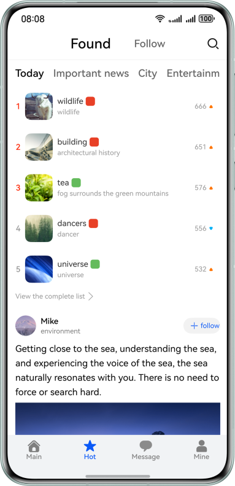
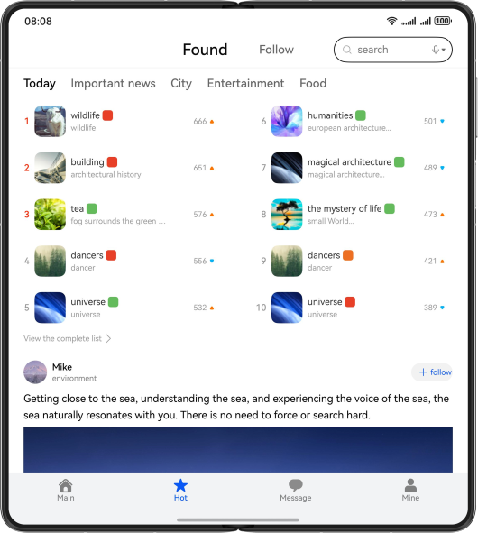
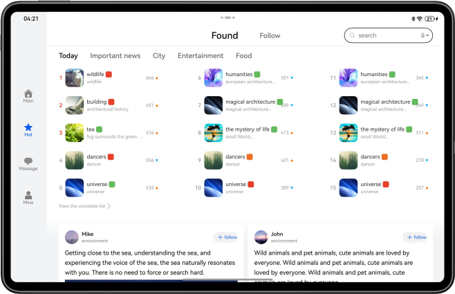

# Community Comments

## Overview

Based on the adaptive and responsive layout, implement community comment pages with one-time development for multi-device deployment.

## Effect
The figure shows the effect on the Bar phone:



The figure shows the effect on the Bi-fold phone:



The figure shows the effect on the Tablet:



## Concepts

- One-time development for multi-device deployment: It enables you to develop and release one set of project code for deployment on multiple devices as demanded. This feature enables you to efficiently develop applications that are compatible with multiple devices while providing distributed user experiences for cross-device transferring, migration, and collaboration.
- Adaptive layout: When the size of an external container changes, elements can automatically change based on the relative relationship to adapt to the external container. Relative relationships include the proportion, fixed aspect ratio, and display priority.
- Responsive layout: When the size of an external container changes, elements can automatically change based on the breakpoints, grids, or specific features (such as the screen direction and window width and height) to adapt to the external container.
- GridRow: It is a container that is used in a grid layout, together with its child component **<GridCol>**.
- GridCol: It is a container that must be used as a child component of the **<GridRow>** container.


## How to Use

1. Install and open an app on a Bar phone, Bi-fold phone, or tablet. The responsive layout and adaptive layout are used to display different effects on the app pages over different devices.
2. Tap home, hot topics, message, or mine tab at the bottom to switch to the corresponding tab page. By default, the message tab page is displayed.
3. Tap a category of hot searches to switch to the corresponding list.
4. Tap the button for viewing complete rankings. The hot search rankings page is displayed. You can swipe up, down, left, or right on the hot search rankings page and tap the back button to return to the hot topics page.
5. Tap an image on the hot topics page to go to the image details page. Only images are displayed on mobile phones, while the content and comments are displayed with images on foldable phones and tablets. Tap the image or the back button to return to the hot topics page.
6. Tap the widget body on the hot topics page to go to the details page. The text area on the details page can be zoomed in or out with two fingers. You can tap the button in the upper right corner of the foldable phone to switch between the left-right layout and top-down layout. Tap the back button to return to the hot topics page.

## Project Directory
```
├──commons/base/src/main/ets                       // Common capability layer
│  ├──constants
│  │  ├──BreakpointConstants.ets                   // Breakpoint constants
│  │  ├──BreakpointType.ets                        // Breakpoint type
│  │  └──CommonConstants.ets                       // Common constants
│  ├──model
│  │  ├──CardListModel.ets                         // Card entity
│  │  ├──CommentModel.ets                          // Comment entity
│  │  ├──HotModel.ets                              // Entity for hot searches
│  │  └──PictureArrayModel.ets                     // Picture entity
│  ├──utils
│  │  └──Logger.ets                                // Logger
│  └──viewmodel
│      └──CommentViewModel.ets                     // Comment management
├──features
│  ├──detail/src/main/ets
│  │  ├──constants
│  │  │  └──CommonConstants.ets                    // Constants for details page
│  │  ├──view
│  │  │  ├──CommentBarView.ets                     // Comment bar
│  │  │  ├──CommentInputView.ets                   // Comment input bar
│  │  │  ├──CommentItemView.ets                    // Comment items
│  │  │  ├──CommentListView.ets                    // Comment list
│  │  │  ├──DetailPage.ets                         // Details page
│  │  │  ├──DetailTitleView.ets                    // Title bar of details page
│  │  │  └──MircoBlogView.ets                      // Card information
│  │  └──viewmodel
│  │     ├──CardArrayViewModel.ets                 // Card list management
│  │     └──CardViewModel.ets                      // Card management
│  ├──hot/src/main/ets
│  │  ├──constants
│  │  │  └──CommonConstants.ets                    // Constants for hot searches
│  │  ├──model
│  │  │  └──FollowModel.ets                        // Entity of following
│  │  └──view
│  │     ├──CardItemView.ets                       // Following card
│  │     ├──FollowView.ets                         // Following page
│  │     ├──FoundView.ets                          // Finding page
│  │     ├──HotColumnView.ets                      // List of hot searches
│  │     ├──HotPointPage.ets                       // Hot searches page
│  │     ├──HotTitleView.ets                       // Titles of hot searches
│  │     ├──SearchBarView.ets                      // Search bar
│  │     └──ToRankView.ets                         // Navigation of hot search ranking
│  ├──picture/src/main/ets
│  │  └──view
│  │     ├──DetailVerticalView.ets                 // Details displayed vertically
│  │     └──PictureDetail.ets                      // Picture details page
│  └──rank/src/main/ets
│     ├──constants
│     │  └──CommonConstants.ets                    // Constants for ranking
│     └──view
│        ├──HotListItemView.ets                    // Items of hot searches
│        ├──HotRankPage.ets                        // Ranking page
│        └──HotListView.ets                        // List of hot searches
└──products
   ├──phone/src/main/ets
   │  ├──entryability
   │  │  └──EntryAbility.ets                       // Application entry
   │  ├──model
   │  │  └──TabBarModel.ets                        // Tab bar entity
   │  ├──pages
   │  │  └──MainPage.ets                           // Main page
   │  ├──view
   │  │  └──TabContentView.ets                     // Tab content of home page
   │  └──viewmodel
   │     └──TabBarViewModel.ets                    // Tab bar management
   └──phone/src/main/resources
```

## How to Implement

The GridRow and GridCol components are used to implement a community comment page for multiple devices based on adaptive and responsive layouts.

## Permissions

N/A.

## Constraints

1. The sample app is supported only on Bar phone, Bi-fold (Mate X series) and Tablet running the standard system.
2. HarmonyOS: HarmonyOS 5.0.5 Release or later
3. DevEco Studio: DevEco Studio 6.0.2 Release or later
4. HarmonyOS SDK: HarmonyOS 6.0.2 Release SDK or later
