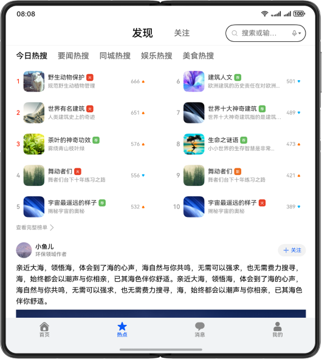

# 多设备社区评论界面

## 项目简介

基于自适应布局和响应式布局，实现一次开发，多端部署的社区评论页。

## 效果预览
直板机运行效果图如下：


双折叠运行效果图如下：



平板运行效果图如下：


## 相关概念

- 一次开发，多端部署：一套代码工程，一次开发上架，多端按需部署。支撑开发者快速高效的开发支持多种终端设备形态的应用，实现对不同设备兼容的同时，提供跨设备的流转、迁移和协同的分布式体验。
- 自适应布局：当外部容器大小发生变化时，元素可以根据相对关系自动变化以适应外部容器变化的布局能力。相对关系如占比、固定宽高比、显示优先级等。
- 响应式布局：当外部容器大小发生变化时，元素可以根据断点、栅格或特定的特征（如屏幕方向、窗口宽高等）自动变化以适应外部容器变化的布局能力。
- GridRow：栅格容器组件，仅可以和栅格子组件（GridCol）在栅格布局场景中使用。
- GridCol：栅格子组件，必须作为栅格容器组件（GridRow）的子组件使用。

## 使用说明

1. 分别在直板机、双折叠、平板安装并打开应用，不同设备的应用页面通过响应式布局和自适应布局呈现不同的效果。
2. 点击底部首页、热点、消息、我的图片文字按钮，切换显示对应的标签页，默认显示热点标签页。
3. 点击热搜标题，切换热搜列表。
4. 点击查看完整榜单按钮，跳转至热搜榜单页。热搜榜单页支持上下及左右滑动，点击返回按钮退回至热点页。
5. 热点页点击图片进入图片详情页。手机设备只展示图片，折叠屏及平板展示正文及评论。点击图片或返回按钮退回至热点页。
6. 热点页点击卡片正文进入详情页。详情页正文文字区域支持双指缩放。折叠屏右上角按钮支持切换左右及上下布局。点击返回按钮退回至热点页。

### 新增功能说明

#### 1. 观点站队投票
- 对于争议话题，评论列表顶部会显示观点站队投票组件
- 用户可选择立场：支持（绿色）、反对（红色）、中立（橙色）
- 实时显示各立场的投票比例和百分比
- 支持取消选择和重新选择

#### 2. 评论情绪热力图
- 每条评论下方显示情绪分析结果
- 支持5种情绪类型：愤怒（红色）、赞同（绿色）、调侃（橙色）、理性讨论（蓝色）、中性（灰色）
- 显示主要情绪和强度百分比
- 点击"详情"可展开查看完整的情绪分布热力图

#### 3. 评论价值判断
- 高质量评论会显示"深度分析"、"专业评论"等蓝色标签，优先展示
- 低质量评论（刷屏、引战、水评）默认折叠，显示折叠原因
- 折叠的评论可手动展开查看，也可重新折叠
- 使用颜色区分质量等级：蓝色（高质量）、灰色（正常）、深橙色（低质量）

## 工程目录
```
├──commons/base/src/main/ets                       // 公共能力层
│  ├──constants
│  │  ├──BreakpointConstants.ets                   // 断点常量类
│  │  ├──BreakpointType.ets                        // 断点类型类
│  │  └──CommonConstants.ets                       // 公共常量类
│  ├──model
│  │  ├──CardListModel.ets                         // 卡片实体类
│  │  ├──CommentModel.ets                          // 评论实体类（含观点站队、情绪分析、质量判断数据）
│  │  ├──HotModel.ets                              // 热搜实体类
│  │  └──PictureArrayModel.ets                     // 图片实体类
│  ├──utils
│  │  └──Logger.ets                                // 日志工具类
│  └──viewmodel
│      └──CommentViewModel.ets                     // 评论管理类（含观点站队、情绪分析、质量判断数据结构）
├──features
│  ├──detail/src/main/ets
│  │  ├──constants
│  │  │  └──CommonConstants.ets                    // 详情页常量类
│  │  ├──view
│  │  │  ├──CommentBarView.ets                     // 评论工具栏
│  │  │  ├──CommentInputView.ets                   // 评论输入栏
│  │  │  ├──CommentItemView.ets                    // 评论项
│  │  │  ├──CommentListView.ets                    // 评论列表
│  │  │  ├──DetailPage.ets                         // 详情页
│  │  │  ├──DetailTitleView.ets                    // 详情页标题栏
│  │  │  ├──MircoBlogView.ets                      // 卡片信息
│  │  │  ├──StanceVoteView.ets                     // 观点站队投票组件
│  │  │  ├──EmotionHeatmapView.ets                 // 评论情绪热力图组件
│  │  │  └──CommentQualityView.ets                 // 评论质量判断组件
│  │  └──viewmodel
│  │     ├──CardArrayViewModel.ets                 // 卡片列表管理类
│  │     └──CardViewModel.ets                      // 卡片管理类
│  ├──hot/src/main/ets
│  │  ├──constants
│  │  │  └──CommonConstants.ets                    // 热搜常量类
│  │  ├──model
│  │  │  └──FollowModel.ets                        // 关注实体类
│  │  └──view
│  │     ├──CardItemView.ets                       // 关注卡片
│  │     ├──FollowView.ets                         // 关注页
│  │     ├──FoundView.ets                          // 发现页
│  │     ├──HotColumnView.ets                      // 热搜列表
│  │     ├──HotPointPage.ets                       // 热搜页
│  │     ├──HotTitleView.ets                       // 热搜标题
│  │     ├──SearchBarView.ets                      // 搜索栏
│  │     └──ToRankView.ets                         // 热搜榜单导航
│  ├──picture/src/main/ets
│  │  └──view
│  │     ├──DetailVerticalView.ets                 // 竖向详情
│  │     └──PictureDetail.ets                      // 图片详情页
│  └──rank/src/main/ets
│     ├──constants
│     │  └──CommonConstants.ets                    // 榜单常量类
│     └──view
│        ├──HotListItemView.ets                    // 热搜项
│        ├──HotRankPage.ets                        // 榜单页
│        └──HotListView.ets                        // 热搜列表
└──products
   ├──phone/src/main/ets
   │  ├──entryability
   │  │  └──EntryAbility.ets                       // 程序入口类
   │  ├──model
   │  │  └──TabBarModel.ets                        // 页签实体类
   │  ├──pages
   │  │  └──MainPage.ets                           // 主界面
   │  ├──view
   │  │  └──TabContentView.ets                     // 首页页签
   │  └──viewmodel
   │     └──TabBarViewModel.ets                    // 页签管理类
   └──phone/src/main/resources
```

## 具体实现

基于自适应布局以及响应式布局，使用GridRow、GridCol实现多设备社区评论页面。

### 新增功能实现

#### 观点站队投票
- **组件**: `StanceVoteView.ets`
- **数据结构**: `StanceType`枚举、`StanceData`接口
- **实现方式**: 在争议话题评论列表顶部显示投票组件，支持三种立场选择，实时显示投票比例

#### 评论情绪热力图
- **组件**: `EmotionHeatmapView.ets`
- **数据结构**: `EmotionType`枚举、`EmotionData`接口
- **实现方式**: 每条评论下方显示情绪分析结果，使用颜色编码和柱状图展示情绪分布

#### 评论价值判断
- **组件**: `CommentQualityView.ets`、`FoldableCommentContainer`
- **数据结构**: `CommentQualityType`枚举、`QualityData`接口
- **实现方式**: 高质量评论显示标签优先展示，低质量评论自动折叠，支持手动展开/收起

## 相关权限

不涉及。

## 约束与限制

1. 本示例仅支持标准系统上运行，支持设备：直板机、双折叠（Mate X系列）、平板。
2. HarmonyOS系统：HarmonyOS 5.0.5 Release及以上。
3. DevEco Studio版本：DevEco Studio 6.0.2 Release及以上。
4. HarmonyOS SDK版本：HarmonyOS 6.0.2 Release SDK及以上。
